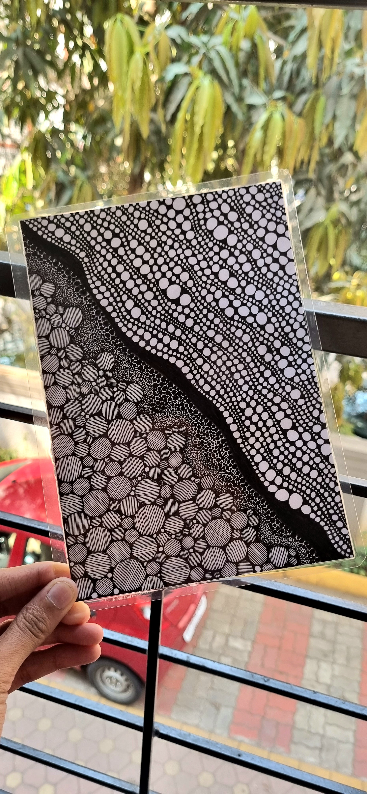
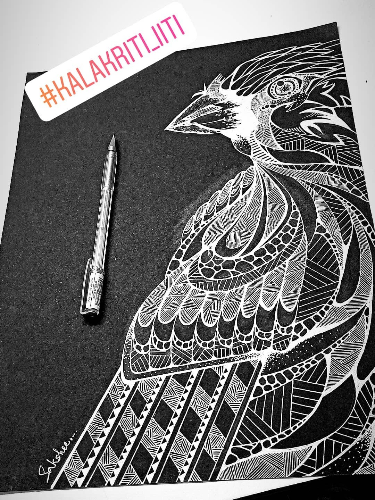
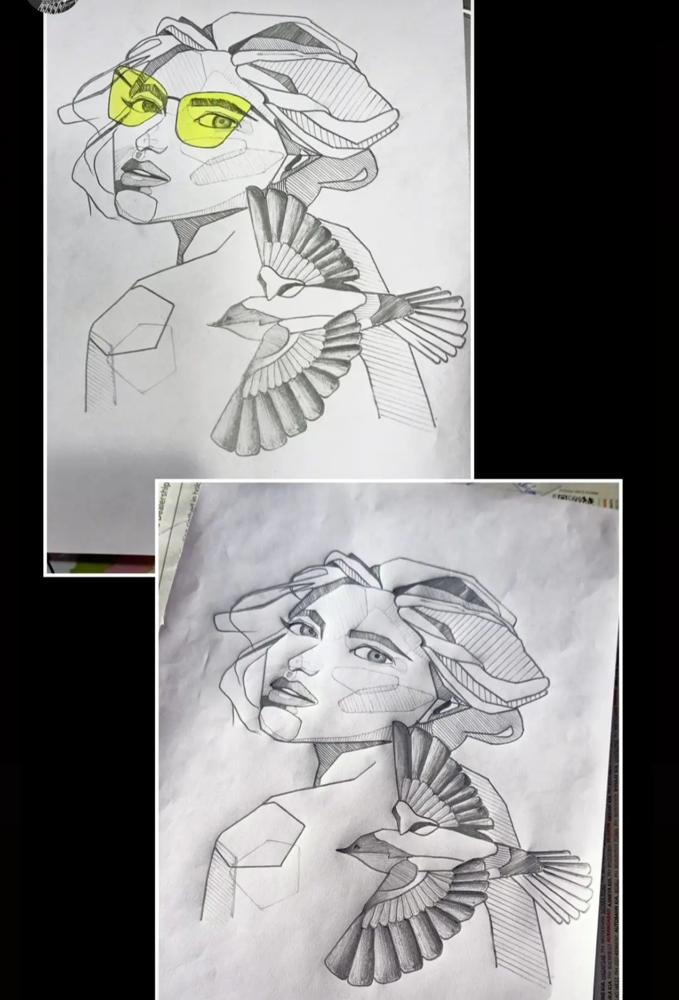
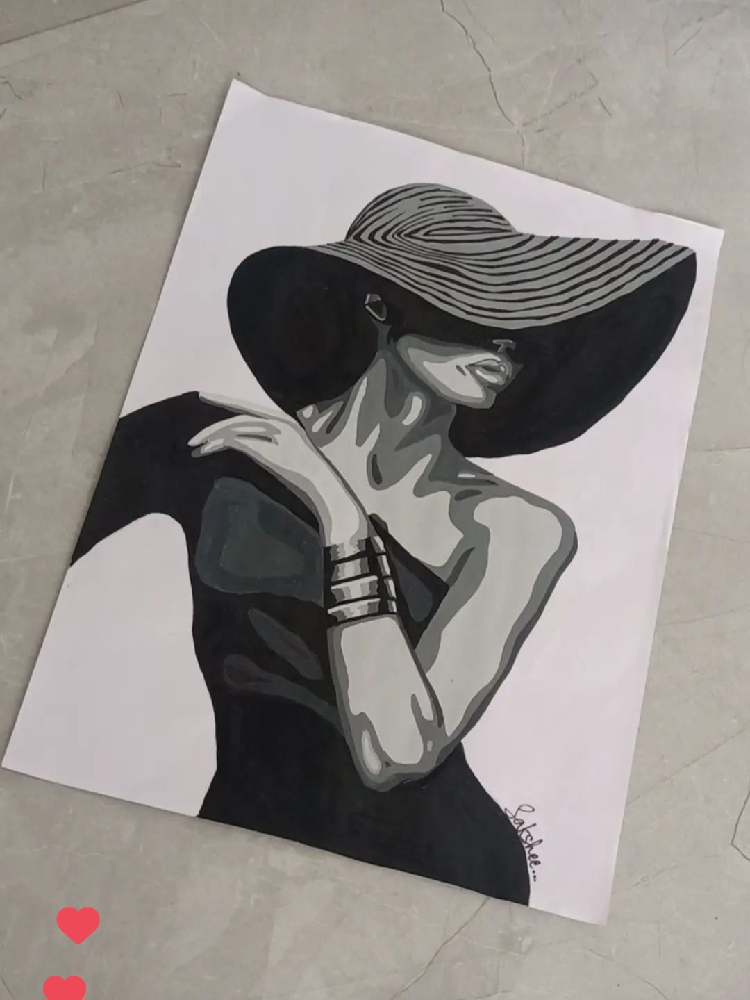
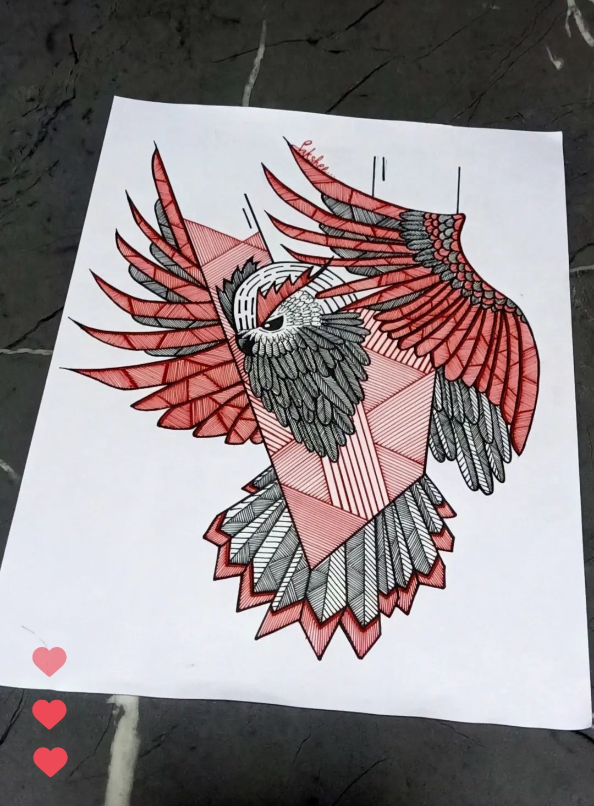
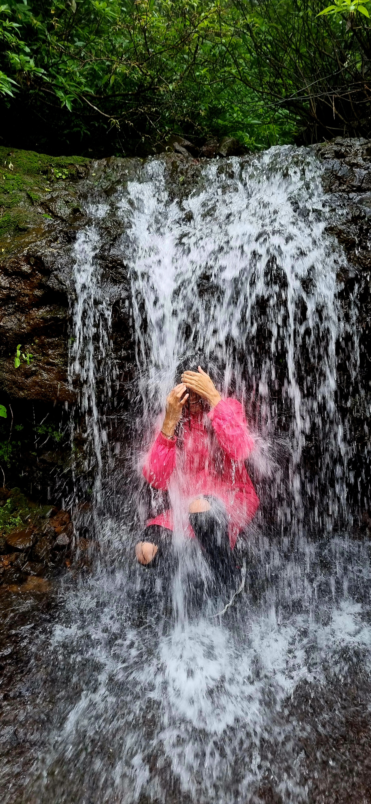
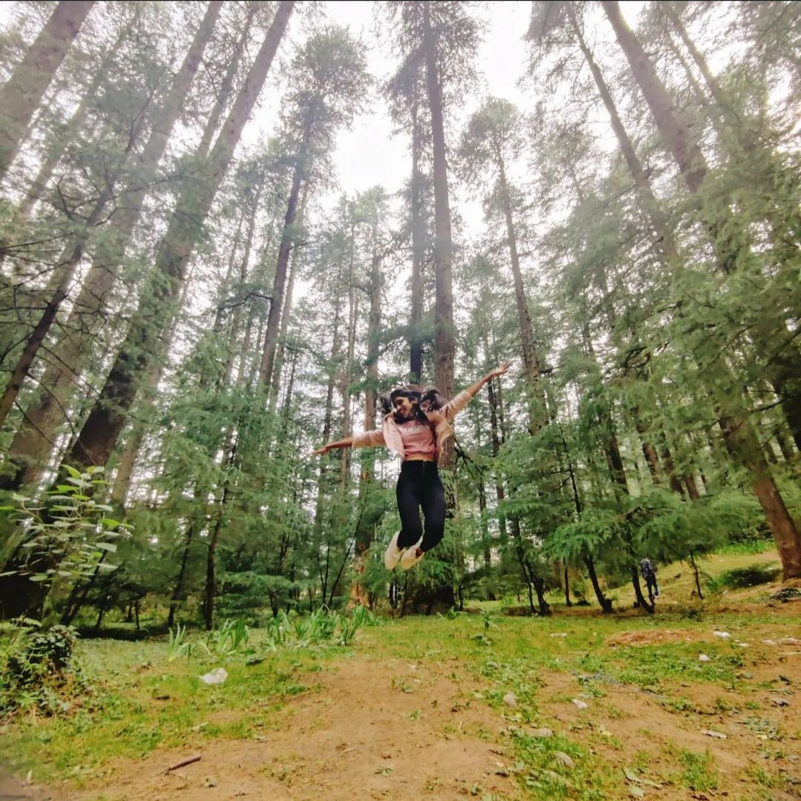
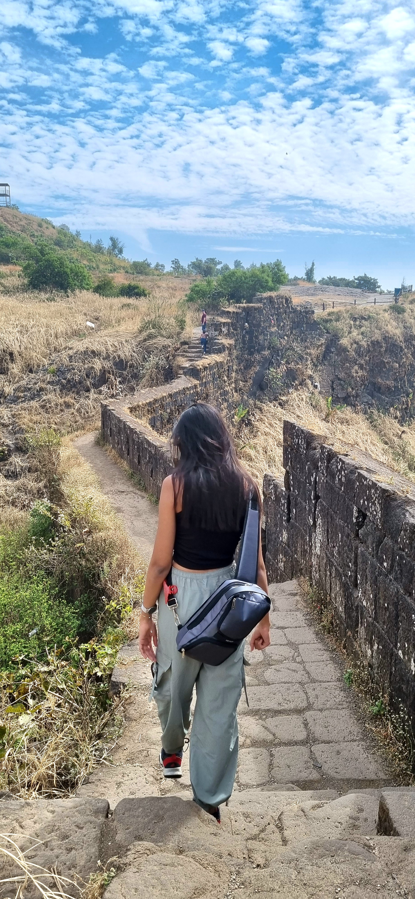

## About Me:

Hey there! I’m **Sakshee**, a curious mind with a passion for blending creativity and cutting-edge tech. Currently pursuing my master’s in [Artificial Intelligence](https://ai.meng.duke.edu/degree) at Duke University, my journey in AI began back in my freshman year and has been anything but ordinary since. I’ve delved into research in computer vision and robotics, applying these innovations to fields like agriculture and manufacturing. Before starting my master’s, I was at Deloitte, where I embraced the challenge of building Generative AI solutions, staying at the forefront of technology. My excitement peaks when I’m working in an industry research and development team, turning ideas into impactful realities.

Whether in the lab or the fast-paced world of industry, I’m driven to create technology that empowers, excites, and elevates everyday life—and I’m just getting started!

---

## Education and Certifications:

  <h3>Duke University</h3>
  
<b>Masters in Artificial Intelligence for Product Innovation</b> 
August' 24 - Present 

- Won the <b>First Grand Prize</b> and <b>Best Use of Agents</b> special prize in the annual 36-hour Duke AI Hackathon amongst 500+ participants.

  <h3>Indian Institute of Technology (IIT) Indore </h3>
  
<b>Bachelor in Technology, Mechanical Engineering</b> 
  Minor in Humanities and Social Sciences 
  May' 18 - May' 22 
  CGPA: 8.65/10

  <h3>Applied Data Science using Python </h3>
  
<b>Coursera</b>, July 2020

  <a href="https://www.coursera.org/account/accomplishments/records/MUYD3HKCTGZS?utm_source=link&utm_medium=certificate&utm_content=cert_image&utm_campaign=sharing_cta&utm_product=course"></a>

[... See more certifications](./certifications)

---

## Work Experience:

  <h3>Deloitte, USI | <a href="https://drive.google.com/drive/folders/1Cer30GNiFHtipCs6lIr2nM3kPn71Wntr?usp=sharing"><em>Awards</em><i class="fa-solid fa-link"></i></a></h3>
  
<b>Analyst - R&D | GenAI Tech</b> | August 2022 - August 2024
 
  <ul>
   <li>Developed a multi-agent LLM system utilizing OpenAI’s Assistants API, enabling autonomous web research, analysis, and generation of deliverables such as newsletters, reports and PowerPoint presentations.</li>
    <li>Built a proof of concept (streamlit) for creating comprehensive, customizable and locally downloadable PowerPoint presentations based on document uploads, tailored to specific topics and target audiences.</li>
    <li>Implemented a scalable Generative AI-based Topic Modeling approach for advanced document analysis.</li>
    <li>Research work: Large Language Model (LLM) Agents and frameworks, including AutoGen, CrewAI, and LangGraph, as well as Retrieval-Augmented Generation (RAG), knowledge graphs, and prompting techniques.</li>
  </ul>

  <h3>National University of Singapore | <a href="https://github.com/Sakshee5/imvotenet"><i class="fa-brands fa-github"></i></a> | <a href="https://medium.com/codex/imvotenet-paper-review-and-code-analysis-bf103117b32e"><em>Article</em><i class="fa-solid fa-link"></i></a></h3>
  <em>Guide: Guillaume Sartoretti</em>
  
<b>Summer Research Intern</b> | Apr 2021 - Aug 2021
 
  <ul>
    <li>Worked on autonomous indoor robotic path planning under unknown, partially interactive environments.</li>
    <li>Created a custom OpenAI gym environment with a Pygame renderer capable of being simulated in Pybullet.</li>
    <li>Reviewed and trained a state-of-the-art 3D Object Detection algorithm (ImVoteNet) on SUN-RGBD Dataset.</li>
  </ul>

[... See all experiences](./work-experience)

---

## Projects:

  <h3>Unsupervised Segmentation of Peck-damaged Rice Grains | <a href="https://github.com/Sakshee5/Rice-Grain-Quality-Inspection-/tree/main"><i class="fa-brands fa-github"></i></a></h3>
  
<b>Agriculture | CNNs | Unsupervised Learning | Pytorch  
  Jan 2022 - Jun 2022</b>
 
  <ul>
    <li>Guide: Dr. Pavan Kankar, Dr. Ankur Miglani | <em>B.Tech Thesis</em></li>
    <li>Earned highest grade for conducting research in a field with limited existing literature, utilizing a novel dataset.</li>
    <li>Developed an unsupervised Convolutional Neural Network (CNN) based segmentation algorithm for the sub-classification of pecky-damaged rice grains, achieving a 92.54 Dice coefficient accuracy.</li>
  </ul>

  <h3>Design and Vision-based Control of Miniature Rolling Capsule | <a href="https://github.com/Sakshee5/Steel-Defect-Detection"><i class="fa-brands fa-github"></i></a></h3>
  
<b>Computer Vision | Robotics | 3D-Printing 
  Apr 2021 - Jan 2022</b>
 
  <ul>
    <li>Guide: Dr. Debanik Roy, Dr. Pavan Kankar, Dr. Ankur Miglani</li>
    <li>Designed & 3D printed a CAD model of a miniature rolling capsule fitted with a CCD camera for pipe inspection.</li>
    <li>Developed a modified U-net architecture for detecting the type, spread, and severity of defects on steel surfaces, achieving an accuracy 2% higher than the baseline results on the dataset.</li>
  </ul>

[... See all projects](./projects)

---

## Publications and Blogs:

<h3 style="margin-bottom:2px; color:var(--clr-a-text);">
  <a href="https://saksheepatil05.medium.com/cracking-the-code-how-adversarial-attacks-manipulate-ai-language-models-239620395e58">
    Cracking the Code: How Adversarial Attacks Manipulate AI Language Models
  </a>
</h3>

  <b>Medium publication by Sakshee Patil</b> 
  Sept 2024 

 

<h3 style="margin-bottom:2px; color:var(--clr-a-text);">
  <a href="https://saksheepatil05.medium.com/demystifying-langgraph-a-beginner-friendly-dive-into-langgraph-concepts-5ffe890ddac0">
    Demystifying LangGraph: A Beginner-Friendly Dive into LangGraph Concepts
  </a>
</h3>

  <b>Medium publication by Sakshee Patil</b> 
  May 2024 

 

<h3 style="margin-bottom:2px; color:var(--clr-a-text);">
  <a href="https://drive.google.com/drive/folders/1Zj8FODrQZ28_UUHMtTjT-vnnxOufIv9t?usp=sharing">
    Classification of peck damaged rice grains using Unsupervised Segmentation
  </a>
</h3>

  <b>Sakshee Patil, <i>et al</i>.</b> 
  Journal Paper, Computers and Electronics in Agriculture, Elsevier 

 

<h3 style="margin-bottom:2px; color:var(--clr-a-text);">
  <a href="https://drive.google.com/drive/folders/1SeUJt5s16n4aFpP1cEXWcC-AxzqBd5T0?usp=sharing">
    Design of Rolling Capsule-type Miniature Robot (RCMR) for Pipe Inspection
  </a>
</h3>

  <b>Sakshee Patil, <i>et al</i>.</b> 
  Book Chapter, Assistive Robotics, CRC Press: Taylor & Francis Group, USA 

 

<h3 style="margin-bottom:2px; color:var(--clr-a-text);"><a href="https://www.sciencedirect.com/science/article/pii/B9780323907897000014">Deep learning-based methods for detecting surface defects in steel plates</a></h3>

<b>Sakshee Patil, <i>et al</i>.</b> 
Book Chapter, Smart Electrical and Mechanical Systems: An Application of Artificial Intelligence and Machine Learning, Elsevier 
24 June 2022. 
Doi: <a href="https://doi.org/10.1016/B978-0-323-90789-7.00001-4">https://doi.org/10.1016/B978-0-323-90789-7.00001-4</a>

 

<h3 style="margin-bottom:2px; color:var(--clr-a-text);">
  <a href="https://medium.com/codex/imvotenet-paper-review-and-code-analysis-bf103117b32e">
    Paper Overview and Code Analysis - ImVoteNet: Boosting 3D Object Detection in Point Clouds with Image Votes
  </a>
</h3>

  <b>CodeX publication by Sakshee Patil</b> 
  July 2021 

---

## Achievements:

    <h4 style="margin-bottom:5px;">Positions of Responsibility:</h4>
    <ul style="margin-left: -1.4em;">
      <li>Core Member, ML-AI focused Cynaptics Club, IIT Indore (2019 - 2022): Initiated "Project Spotlight", a series where alumni were invited to share their industry experiences and discuss AI-based projects.</li>
      <li>Member of core mentorship team responsible for managing a three-tier structure of student mentees, student mentors, and faculty advisors (2018 - 2019).</li>
      <li>Member of Kalakriti, Fine Arts Club, IIT Indore (2018 - 2022): Contributed to the design and execution of campus-wide art installations, conducted art workshops for students.</li>
      <li>Member of the Debating Society and Dance Club, IIT Indore (2018 - 2020).</li>          
    </ul>

    <h4 style="margin-bottom:5px;">Academic Achievements:</h4>
    <ul style="margin-left: -1.4em;">
      <li><strong>Silver Medalist</strong>, Inter-IIT Technical Meet, 2021: Led a 10-member team as part of the AI-ML Club.</li>
      <li><strong>Finalist</strong>, Smart India Hackathon 2020: Participated in a nationwide 36-hour product development competition.</li>
      <li><strong>Nominee</strong>, Best B.Tech Project Award: Recognized for outstanding project work.</li>
      <li><strong>Recipient</strong>, Summer Research Fellowship, Indian Academy of Sciences, 2020.</li>
      <li><strong>Invited Intern</strong> (Cancelled due to COVID-19), LCIT Lab, Lyon, France, 2020: Summer internship focusing on 
      image processing of vehicles.</li>
      <li> Cleared Joint Entrance Examination (JEE) - Advanced 2018 with All India Rank 8907 amongst 12 lakh+ students. </li>     
    </ul>

    <h4 style="margin-bottom:5px;">Extra-Curricular Achievements:</h4>
    <ul style="margin-left: -1.4em;">
      <li>Competed in 'E-Yantra' 2019, a pan-India Robotics challenge organized by IIT Bombay.</li>
      <li>Certified in elementary A1 level German language.</li>
      <li>Served as a member of the Design and Publicity team for Fluxus, Central India's largest cultural fest by IIT Indore.</li>
      <li>Achieved 'A' grade in Maharashtra State Level Elementary and Intermediate Art exam.</li>
    </ul>

---

## Community Work:

<ul style="margin-left: -1.4em;">
  <li>Volunteered in the Ekostitch Drive, focusing on stitching and block printing initiatives to advocate fabric recycling for a sustainable future in collaboration with the non-profit organization: United Way Mumbai.</li> 
  <li>Volunteered for "Lend Your Voice" Campaign, recording audio books to aid Samarthanam Trust for the Disabled.</li>
</ul>

---

## Who am I?:

  
🎨 <b>Artist Extraordinaire</b>: If it's intricate, I'm all in.

  
🕺 <b>Shuffle Buff</b>: I enjoy dancing, especially shuffling. Two months of shuffling with a skipping rope taught me that combining two talents can be hilariously challenging!

  
🏕️ <b>Adventure Enthusiast</b>: Hiking, trekking, camping—you name it, I’m there. The outdoors is my happy place.

  
📚 <b>Fiction Fanatic</b>: Give me a novel with a good plot twist, and I'm hooked. As for self-help and philosophy? I’d rather watch them on screen.

  
🧩 <b>Puzzle Addict</b>: Wordle, Connections, Strands, Spelling Bee, Cross-Wordle—you'll find me diving into New York Times games every day. It’s like a mental workout but way more fun!

  
💪 <b>Fitness Enthusiast</b>: I workout every day to stay toned. With a great metabolism on my side, I put in that extra effort to keep things in shape.

  
🎹 <b>Keyboard Newbie</b>: Just started learning the keyboard, so if you hear some off-key notes, that’s me practicing!

    <!-- Add your pictures here -->
    
    
    
    
    
    
    
    
    

